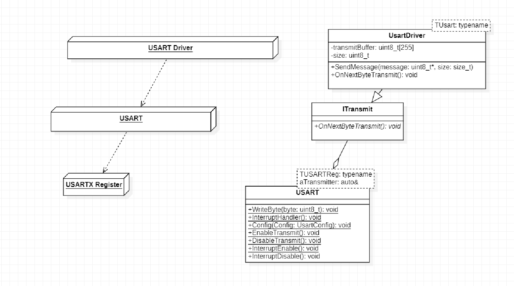
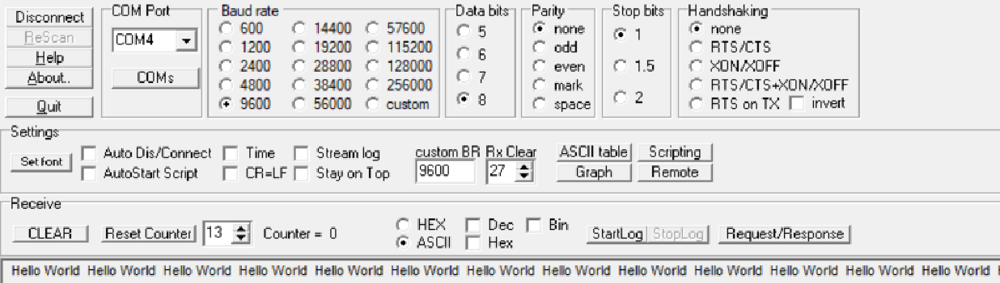

== Лабораторная работа

---

=== Задание:

*Передавать данные в виде строки _Hello World_ по _USART_ с помощью драйвера.*

=== *Выполнение работы:*

Перед написанием кода создадим архитектуру проекта в _StarUML_ для упрощения дальнейшей работы:

.Архитектура проекта

Класс _USARTDriver_  обертка для _USART_. Он не взаимодействует с регистрами напрямую, а
вызывает необходимые методы класса _Usart,_ находящегося на более низкой ступени архитектуры. Таким образом достигается
универсальность программы, то есть имеется возможность запуска программы на практически любом микроконтроллере с небольшими
правками методов класса _Usart_.

Принцип действия программы:

1) Вызываем метод _SendMessage_, отправляется один байт переданной на вход метода строки.

2) Возникает прерывание по передаче, в обработчике которого передается следующий байт.

3) Прерывания будут происходят до тех пор, пока не будет передан последний байт строки.

4) Прервания отключаются до следующего вызова метода _SendMessage_.

Ниже представлена работа программы в _Terminal_:

*Код программы:*

[source, cpp]
----
main.cpp

#include "gpioaregisters.hpp"  //for Gpioa
#include "gpiocregisters.hpp"  //for Gpioc
#include "gpiobregisters.hpp"  //for Gpiob
#include "rccregisters.hpp"    //for RCC
#include "tim2registers.hpp"   //for SPI2
#include "nvicregisters.hpp"   //for NVIC
#include "usartconfig.h"       //for usartconfig

using namespace std ;
constexpr std::uint32_t UartSpeed9600 = std::uint32_t(16000000U / 9600U) ;

extern "C"
{
int __low_level_init(void)
{
  //Switch on external 16 MHz oscillator
  RCC::CR::HSION::On::Set() ;
  while (!RCC::CR::HSIRDY::Ready::IsSet())
  {}
  //Switch system clock on external oscillator
  RCC::CFGR::SW::Hsi::Set() ;
  while (!RCC::CFGR::SWS::Hsi::IsSet())
  {}

  RCC::AHB1ENR::GPIOAEN::Enable::Set() ;
  RCC::APB1ENRPack<
    RCC::APB1ENR::TIM2EN::Enable,
    RCC::APB1ENR::USART2EN::Enable
    >::Set() ;

  GPIOA::MODERPack<
    GPIOA::MODER::MODER2::Alternate, // Uart2 TX
    GPIOA::MODER::MODER3::Alternate  // Uart2 RX
    >::Set() ;

  GPIOA::AFRLPack <
    GPIOA::AFRL::AFRL2::Af7, // Uart2 TX
    GPIOA::AFRL::AFRL3::Af7  // Uart2 RX
    >::Set() ;

    USART2::BRR::Write(UartSpeed9600) ;
    USART2::CR1::UE::Enable::Set() ;
    NVIC::ISER1::Write(1<<6);
  // TIM2
  TIM2::PSC::Write(16000) ;
  TIM2::ARR::Write(1000) ;
  TIM2::SR::UIF::NoUpdate::Set();
  TIM2::CNT::Write(0);
  TIM2::CR1::CEN::Enable::Set() ;
  return 1;
}
}

int main()
{
  const char* message = "Hello World \n";
  for(;;)
  {
    usartDriver.SendMessage(message, strlen(message));
    while(TIM2::SR::UIF::NoUpdate::IsSet()) ;
    TIM2::SR::UIF::NoUpdate::Set();
  }
  return 0 ;
}
----

[source, cpp]
----
usart.h

#pragma once
#include <cstdint>
#include "Itransmit.h"
#include "usart2registers.hpp"

template<typename TUSARTReg, auto& aTransmitter>
class Usart
{
  public:
    static void WriteByte(std::uint8_t byte)
  {
    TUSARTReg::DR::Write(byte);
  }

  static void InterruptHandler()
  {
    if(TUSARTReg::SR::TXE::DataRegisterEmpty::IsSet() &&  TUSARTReg::CR1::TXEIE::InterruptWhenTXE::IsSet())
    {
      aTransmitter.OnNextByteTransmit();
    }

  }
  static void TransmitEnable()
  {
    TUSARTReg::CR1::TE::Enable::Set();
  }

  static void InterruptEnable()
  {
    TUSARTReg::CR1::TXEIE::InterruptWhenTXE::Set();
  }

  static void InterruptDisable()
  {
    TUSARTReg::CR1::TXEIE::InterruptInhibited::Set();
  }

  static void TransmitDisable()
  {
    TUSARTReg::CR1::RE::Disable::Set();
  }

};

----

[source, cpp]
----
USARTDriver.h

#pragma once
#include <array>
#include "Itransmit.h"
#include <cassert>

template<typename TUsart>
class USARTDriver
{
public:
  void OnNextByteTransmit()
  {
    TUsart::WriteByte(TransmitBuffer[i++]);
    if (i >= size)
    {
      TUsart::TransmitDisable();
      TUsart::InterruptDisable();
      i = 0U;
    }
  }
  void SendMessage(const char* message, size_t aSize)
  {
    assert(size <= 255);
    memcpy(TransmitBuffer.data(), message, aSize);
    size = aSize;
    i = 0U;
    TUsart::WriteByte(TransmitBuffer[i++]);
    TUsart::TransmitEnable();
    TUsart::InterruptEnable();
  }

private:
  std::size_t i = 0U;
  std::array<std::uint8_t, 255> TransmitBuffer;
   size_t size = 0U;
};

----

[source, cpp]
----
usartconfig.hpp

#pragma once
#include "usart.h"
#include "usart2registers.hpp"
#include "USARTDriver.h"

class Usart2;

inline USARTDriver <Usart2> usartDriver;
class Usart2: public Usart < USART2, usartDriver>
{};
----

[source, cpp]
----
Itransmit.h

#pragma once
class ITransmit
{
public:
  virtual void OnNextByteTransmit() = 0;
};

----

